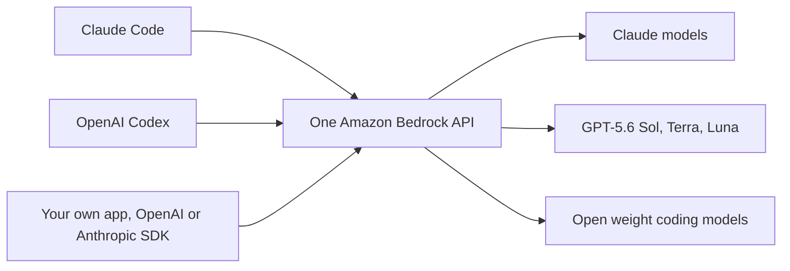
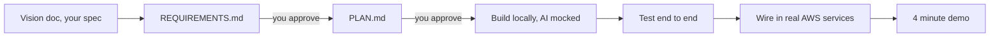

# Welcome, Here Is Your Day 👋

*Everything you need to know before you build, in one page. We walk through this live at the start of the day, and it stays here so you can come back to it any time.*

---

## 1. 🎁 What you get today

- **Your team's own AWS sandbox account**, build with real services, not just code
- **Claude Code in your browser**, an AI coding agent on Amazon Bedrock, unlimited tokens, nothing to install
- **AWS experts in the room all day**, plus our partners Metal Toad and Progress
- All you need is a laptop, Wi-Fi, and a browser

**Getting in takes one minute:** go to [catalog.us-east-1.prod.workshops.aws/join](https://catalog.us-east-1.prod.workshops.aws/join), enter the event code we give you in the room, and you land on your dashboard. Full steps in the [Setup Guide](SETUP-GUIDE.md).

---

## 2. 📰 The latest on AWS, July 2026

The pace right now is remarkable. Everything below shipped in the last few weeks:

| What | When | Why it matters |
|---|---|---|
| **Claude Opus 5** on Amazon Bedrock | July 24 | The newest flagship, zero data retention on by default |
| **OpenAI GPT-5.6** Sol, Terra, Luna on Bedrock | July 13 | Two frontier labs, one API |
| **Claude Sonnet 5** and **Claude Fable 5** on Bedrock | June | Fable 5 is the first Mythos class model, 1M token context |
| **Bedrock AgentCore Harness** went GA | June 17 | Define a production agent in configuration alone |

And the agent ecosystem matured with it:

- **Bedrock AgentCore** runs production agents with any framework and any model
- **Strands Agents**, the AWS open source agent SDK, passed **50 million downloads**
- One Bedrock endpoint now speaks **both the OpenAI and Anthropic APIs**, swap the base URL and your existing code works
- Privacy that publishers care about: **model providers never see your prompts**, models run inside AWS operated accounts

> **The takeaway:** one API in your sandbox account reaches the newest models from two frontier labs, plus open weight coding models, with your data staying in AWS.

---

## 3. 🤖 The coding agents, and which one you use today

Three agents matter right now, and they all converged on the same idea: **plan first, then execute.**

| Agent | What it is | On AWS |
|---|---|---|
| **Claude Code** | Agentic coding in your terminal or browser | Runs on Bedrock with your AWS account, no Anthropic account needed |
| **Kiro** | AWS's spec first agentic IDE | Built by AWS, Claude Opus 5 and GPT-5.6 added this month |
| **OpenAI Codex** | OpenAI's coding agent, CLI and IDE plugins | GA on Bedrock since June, signs in with AWS credentials |

They meet on the same platform:



**Today you use Claude Code.** It is already set up in your browser. Open the terminal and type:

```bash
claude
```

That is it. The sandbox has **Claude Opus 4.6** and **Claude Sonnet 4.6**, switch between them any time with the `/model` command.

---

## 4. 📐 The method: spec driven development

We all love vibe coding, prompt, prompt, prompt, and something works. The problem: nobody wrote down the assumptions, so it breaks the moment you change it.

| Vibe coding | Spec driven, today |
|---|---|
| Prompt, then code immediately | Spec first, then requirements, then plan, then code |
| Assumptions hidden in the model | Assumptions written down and reviewed |
| The chat is the memory | The spec files are the memory |
| Great for demos | Gets to production |

Here is your whole afternoon as one picture. At every arrow, **the agent proposes and you approve**:



You do not have to invent any of this. The **[Build Guide](BUILD-GUIDE.md#step-1-requirements-requirementsmd) has the exact copy paste prompts** for every step, requirements, plan, build, test, and demo prep. Open it, copy the Step 1 prompt, paste in your vision doc, and go.

This is a pocket version of [AI-DLC](https://github.com/awslabs/aidlc-workflows), the open source AI driven development lifecycle from AWS, and it is the single biggest thing that separates teams that demo from teams that debug.

---

## 5. 💡 Pick your idea

**[Twelve real publishing problems, browse them all here](README.md#the-ideas)**, each buildable in an afternoon, each with a plain English explanation and a ready made spec in [`vision-docs/`](vision-docs/):

| | |
|---|---|
| 1. [AI Backlist Revitalizer](ideas/01-ai-backlist-revitalizer.md) | 7. [Cultural Adaptation Engine](ideas/07-cultural-adaptation-engine.md) |
| 2. [Intelligent Content Triage](ideas/02-intelligent-content-triage.md) | 8. [Reader Drop-Off Predictor](ideas/08-reader-drop-off-predictor.md) |
| 3. [One Story, Every Format](ideas/03-one-story-every-format.md) | 9. [Ask Your Archive](ideas/09-ask-your-archive.md) |
| 4. [AI Rights & Permissions Navigator](ideas/04-rights-permissions-navigator.md) | 10. [Subscriber Save Engine](ideas/10-subscriber-save-engine.md) |
| 5. [Immersive Audio Engine](ideas/05-immersive-audio-engine.md) | 11. [AI Story Studio](ideas/11-ai-story-studio.md) ⚠️ |
| 6. [Real-Time Fact-Checker](ideas/06-real-time-fact-checker.md) | 12. [Autonomous Retention Desk](ideas/12-newsroom-retention-desk.md) ⚠️ |

They span the whole publishing world, marketing, editorial, audio, rights, localization, audience, and retention. The two marked ⚠️ are **advanced multi agent builds** with [Strands Agents](https://strandsagents.com/), for teams who want the harder challenge. Pick whichever problem your team actually cares about, that is the one you will build best.

**Own idea?** Also welcome. Copy the [vision template](templates/vision-template.md), fill it in, 15 minutes.

---

## 6. 🏁 Build, then demo

| The day | |
|---|---|
| Right now | This walkthrough, then form teams of about five |
| Next | Pick one idea per team, run the [Setup Guide](SETUP-GUIDE.md), about 5 minutes |
| Most of the day | Build for about 4.5 hours with the [Build Guide](BUILD-GUIDE.md) |
| Around 4:00 PM | Demos, 4 minutes each |

Judges score four things, the full detail is in the [Judging Rubric](JUDGING-RUBRIC.md), read it **before** you build:

1. **Innovation**, creative use of AI on a real publishing problem
2. **Technical execution**, does it work, a working demo beats a beautiful mockup
3. **Business impact**, would a publisher actually pay for this
4. **Presentation**, a clear story, problem, solution, demo, impact

Two rules of thumb from us: **one polished feature beats five broken ones**, and the most common mistake every year is building too much. Scope down, then scope down again.

---

## 7. ✅ Your checklist

- [ ] Form a team of about five
- [ ] Pick an idea, or bring your own with the [vision template](templates/vision-template.md)
- [ ] Run the [Setup Guide](SETUP-GUIDE.md), join, credentials, smoke test
- [ ] Open your idea's vision doc in [`vision-docs/`](vision-docs/)
- [ ] Follow the [Build Guide](BUILD-GUIDE.md), paste the Step 1 prompt into Claude Code
- [ ] Build in small loops, approve each stage
- [ ] Stuck? [Troubleshooting](TROUBLESHOOTING.md), an AWS expert, or ask Claude Code itself
- [ ] Demo at 4

**Let's build.** 🚀
